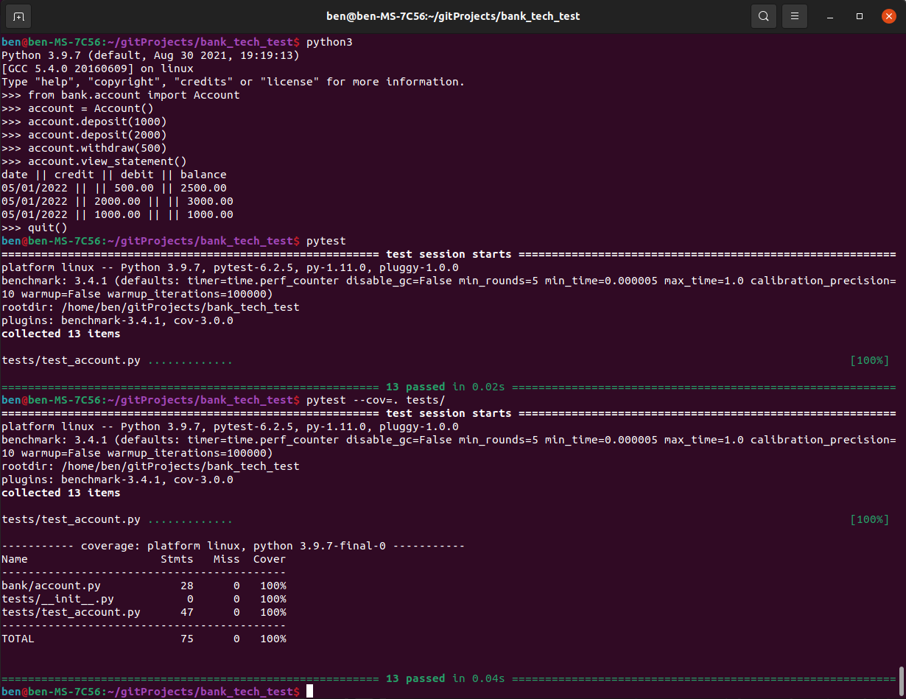
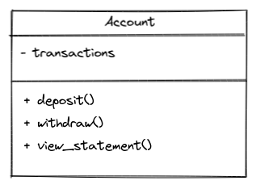

# bank-tech-test

### Specification

##### Requirements

* You should be able to interact with your code via a REPL like IRB or the JavaScript console.  (You don't need to implement a command line interface that takes input from STDIN.)
* Deposits, withdrawal.
* Account statement (date, amount, balance) printing.
* Data can be kept in memory (it doesn't need to be stored to a database or anything).

##### Acceptance criteria

**Given** a client makes a deposit of 1000 on 10-01-2023  
**And** a deposit of 2000 on 13-01-2023  
**And** a withdrawal of 500 on 14-01-2023  
**When** she prints her bank statement  
**Then** she would see

```
date || credit || debit || balance
14/01/2023 || || 500.00 || 2500.00
13/01/2023 || 2000.00 || || 3000.00
10/01/2023 || 1000.00 || || 1000.00
```

### Outcome and Use

Use the code in a Python REPL as per the screenshot.

To run tests:
```
pytest
```

To see test coverarge run the following from the root directory:
```
pip install pytest-cov
pytest --cov=. tests/
```



### Approach

##### User stories

```
As a user
So that I have a place to store money
I want to be able to open a new account
```

```
As a user
So I can make a store my money
I want to be able to make a deposit
```

```
As a user
So I can access my stored money
I want to be able to make a withdrawal
```

```
As a user
So I can see a history of transactions
I want to be able to see an account statement
```

##### Diagram



I wanted to start with user stories to break the task down into its smallest components and ensure I am only implementing the features required. I than drew a UML diagram to ensure that my approach would work in order to avoid the potential for extensive refactoring later.

I think its beneficial to work towards a skeleton of the features I'm looking to build, so I can understand if the bigger picture will fit together. To this end, I wanted to look at all user stories first before moving on to refactoring the code and tests, and looking at edge cases.

The main thinking points from the task:
* Transactions from newest to oldest: I overcomplicated this issue by trying to create a new running total on each print out of the statement (which required additional work due to the reverse order), before realising at the refactor stage that the best solution was to simply add the balance to the list of transactions when it is created as it will not change.
* Date validation: this required some thought both on the testing side (using regex to validate format), and on the code side to get the date to the desired format.
* Storage of transactions: I started by storing the transactions as a list of lists, but because it caused the code to be unreadable when the list was being manipulated I decided to change to a list of dictionaries.